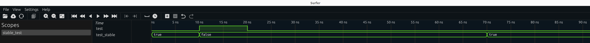
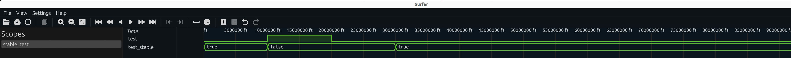

# Behaviour of attribute *'stable* in GHDL, NVC, Modelsim

## GHDL
```bash
$ bash run_ghdl.sh 
GHDL 5.0.0-dev (4.1.0.r288.g10fbb188b) [Dunoon edition]
 Compiled with GNAT Version: 12.3.0
 static elaboration, mcode JIT code generator
Written by Tristan Gingold.

Copyright (C) 2003 - 2024 Tristan Gingold.
GHDL is free software, covered by the GNU General Public License.  There is NO
warranty; not even for MERCHANTABILITY or FITNESS FOR A PARTICULAR PURPOSE.
stable_test.vhd:29:7:@70ns:(assertion error): Assert from process!
stable_test.vhd:29:7:@80ns:(assertion error): Assert from process!
stable_test.vhd:29:7:@90ns:(assertion error): Assert from process!
stable_test.vhd:29:7:@100ns:(assertion error): Assert from process!
```



## NVC

```bash

nvc 1.15.2 (1.15.2.r0.g2fe12d4f) (Using LLVM 14.0.0)
Copyright (C) 2011-2025  Nick Gasson
This program comes with ABSOLUTELY NO WARRANTY. This is free software, and
you are welcome to redistribute it under certain conditions. See the GNU
General Public Licence for details.
** Error: 40ns+0: Assert from process!
   Process :stable_test:_p1 at stable_test.vhd:18
** Error: 50ns+0: Assert from process!
   Process :stable_test:_p1 at stable_test.vhd:18
** Error: 60ns+0: Assert from process!
   Process :stable_test:_p1 at stable_test.vhd:18
** Error: 70ns+0: Assert from process!
   Process :stable_test:_p1 at stable_test.vhd:18
** Error: 80ns+0: Assert from process!
   Process :stable_test:_p1 at stable_test.vhd:18
** Error: 90ns+0: Assert from process!
   Process :stable_test:_p1 at stable_test.vhd:18
** Error: 100ns+0: Assert from process!
   Process :stable_test:_p1 at stable_test.vhd:18
```



## Modelsim

```bash
$ bash run_vsim.sh 
Model Technology ModelSim - Intel FPGA Edition vmap 2020.1 Lib Mapping Utility 2020.02 Feb 28 2020
vmap work work 
Modifying modelsim.ini
Model Technology ModelSim - Intel FPGA Edition vcom 2020.1 Compiler 2020.02 Feb 28 2020
Start time: 09:55:39 on Mar 27,2025
vcom -2008 stable_test.vhd 
-- Loading package STANDARD
-- Loading package TEXTIO
-- Loading package std_logic_1164
-- Compiling entity stable_test
-- Compiling architecture behave of stable_test
End time: 09:55:39 on Mar 27,2025, Elapsed time: 0:00:00
Errors: 0, Warnings: 0
Reading pref.tcl

# 2020.1

# vsim -c work.stable_test -do "run -all; quit" 
# Start time: 09:55:39 on Mar 27,2025
# Loading std.standard
# Loading std.textio(body)
# Loading ieee.std_logic_1164(body)
# Loading work.stable_test(behave)
# run -all
# ** Error: Assert from process!
#    Time: 70 ns  Iteration: 0  Instance: /stable_test
# ** Error: Assert from process!
#    Time: 80 ns  Iteration: 0  Instance: /stable_test
# ** Error: Assert from process!
#    Time: 90 ns  Iteration: 0  Instance: /stable_test
# ** Error: Assert from process!
#    Time: 100 ns  Iteration: 0  Instance: /stable_test
#  quit
# End time: 09:55:39 on Mar 27,2025, Elapsed time: 0:00:00
# Errors: 4, Warnings: 0
```
