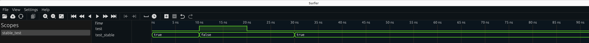

# 'stable behaviour in NVC vs ghdl

```bash
$ bash run_ghdl.sh 
GHDL 5.0.0-dev (4.1.0.r288.g10fbb188b) [Dunoon edition]
 Compiled with GNAT Version: 12.3.0
 static elaboration, mcode JIT code generator
Written by Tristan Gingold.

Copyright (C) 2003 - 2024 Tristan Gingold.
GHDL is free software, covered by the GNU General Public License.  There is NO
warranty; not even for MERCHANTABILITY or FITNESS FOR A PARTICULAR PURPOSE.
stable_test.vhd:29:7:@70ns:(assertion error): Assert from process!
stable_test.vhd:29:7:@80ns:(assertion error): Assert from process!
stable_test.vhd:29:7:@90ns:(assertion error): Assert from process!
stable_test.vhd:29:7:@100ns:(assertion error): Assert from process!
```


```bash
$ bash run_nvc.sh 
nvc 1.15-devel (1.14.0.r206.g5cca94bb) (Using LLVM 14.0.0)
Copyright (C) 2011-2024  Nick Gasson
This program comes with ABSOLUTELY NO WARRANTY. This is free software, and
you are welcome to redistribute it under certain conditions. See the GNU
General Public Licence for details.
** Error: 40ns+0: Assert from process!
   Process :stable_test:_p1 at stable_test.vhd:18
** Error: 50ns+0: Assert from process!
   Process :stable_test:_p1 at stable_test.vhd:18
** Error: 60ns+0: Assert from process!
   Process :stable_test:_p1 at stable_test.vhd:18
** Error: 70ns+0: Assert from process!
   Process :stable_test:_p1 at stable_test.vhd:18
** Error: 80ns+0: Assert from process!
   Process :stable_test:_p1 at stable_test.vhd:18
** Error: 90ns+0: Assert from process!
   Process :stable_test:_p1 at stable_test.vhd:18
** Error: 100ns+0: Assert from process!
   Process :stable_test:_p1 at stable_test.vhd:18
```


